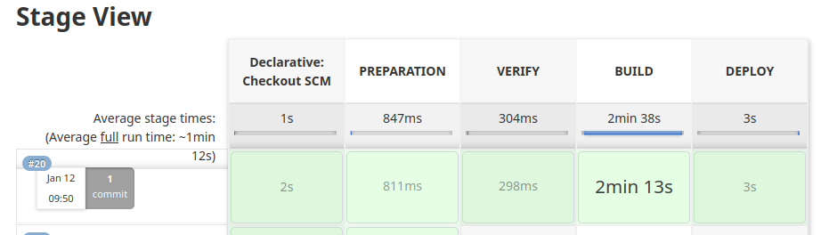

# Jenkins Pipeline Example Deploying into Kubernetes

## Prerequisites

Follow the [instructions](https://github.com/jeremymv2/k8s_cicd/tree/main/jenkins/installation) in order to deploy
Jenkins into your PF9 managed Kubernetes environment.

## Pipeline Overview



The Jenkins Pipeline has four stages: Preparation, Verify, Build and Deploy.

**Preparation**:
- Here we simply extract the application version from `package.json` and assign it to a variable for use
in other stages.

**Verify**:
- This is fundamental step to all CI/CD pipelines. Here the application's unit, lint, and style tests
are executed. All these tests should be quick executing should not be long running, such as integration tests
which should be run later in the pipeline.

**Build**:
- Here the pipeline builds a new container image of the application, tags it with the new version and publishes to
the image registry.

**Deploy**:
- As you might have guessed, this is the stage where the K8s manifests are applied into the PF9 managed kubernetes environment.


## Operating the Pipeline

- Discover the applications load balancer IP:

```bash
$ kubectl get service p9-react-app
```
Use your browser to navigate to the External IP of the exposed application service in the Kubernetes cluster. Observe the application
version at the very bottom of the page.

- Make a change to one the k8s manifests. This will not trigger a new image build but will skip right to the Deploy stage.
For instance, change `replicas: 2` -> `replicas: 1` in `k8s/01_app.yaml`. Commit the change and observe the pipeline jump
right to the deployment. Then observe the change reflected in the `Deployment` type for the application. The application's `version`
label did not change as result of the change to the manifest. Also, notice the `commit_sha` annotation. Click the URL to view the exact
change, as reflected in github.

```bash
$ kubectl describe deployment p9-react-app
Name:                   p9-react-app
Namespace:              default
CreationTimestamp:      Mon, 10 Jan 2022 09:12:26 -0500
Labels:                 <none>
Annotations:            commit_sha: https://github.com/jeremymv2/k8s_cicd/commit/9428712493075e41ed3ce0717312feb93bd1cfdb
                        deployment.kubernetes.io/revision: 46
Selector:               app=p9-react-app
Replicas:               1 desired | 1 updated | 1 total | 1 available | 0 unavailable
StrategyType:           RollingUpdate
MinReadySeconds:        0
RollingUpdateStrategy:  25% max unavailable, 25% max surge
Pod Template:
  Labels:       app=p9-react-app
                version=0.0.25
  Annotations:  kubectl.kubernetes.io/restartedAt: 2022-01-11T19:58:00Z
  Containers:
   p9-react-app:
    Image:        jmv2/webapp01:0.0.25
    Port:         8080/TCP
    Host Port:    0/TCP
    Environment:  <none>
    Mounts:       <none>
  Volumes:        <none>
Conditions:
  Type           Status  Reason
  ----           ------  ------
  Available      True    MinimumReplicasAvailable
  Progressing    True    NewReplicaSetAvailable
OldReplicaSets:  <none>
NewReplicaSet:   p9-react-app-7c4778d8f (1/1 replicas created)
Events:
  Type    Reason             Age                 From                   Message
  ----    ------             ----                ----                   -------
  Normal  ScalingReplicaSet  58m                 deployment-controller  Scaled up replica set p9-react-app-64f7c5f7cf to 1
  Normal  ScalingReplicaSet  58m                 deployment-controller  Scaled down replica set p9-react-app-64f7c5f7cf to 0
  Normal  ScalingReplicaSet  58m                 deployment-controller  Scaled up replica set p9-react-app-674f99b8fc to 1
  Normal  ScalingReplicaSet  49m (x32 over 25h)  deployment-controller  (combined from similar events): Scaled down replica set p9-react-app-6d7dbfb5bf to 0
```

- Next, make a change to the application code. For instance, modify line 15 of `src/App.js`. As before,
commit the change. This time, observe the Github [action](https://github.com/jeremymv2/k8s_cicd/actions) run first, auto
bumping the application version in `package.json` and updating the [Changelog](https://github.com/jeremymv2/k8s_cicd/blob/main/jenkins/webapp01/CHANGELOG.md).
Also, you can observe the Jenkins pipeline running through all four stages, ultimately building and deploying the change.
Finally, go back to the application's website in your browser and notice the version has changed, accurately reflecting the latest
tag in the github repository.
